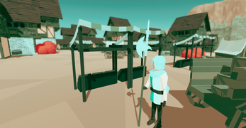
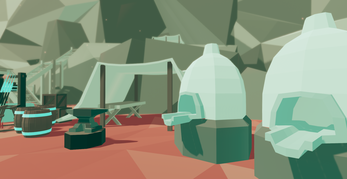
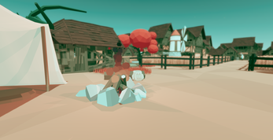
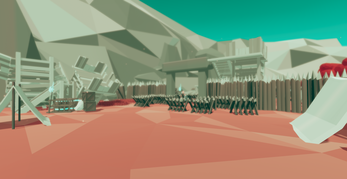
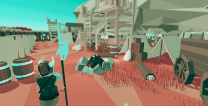
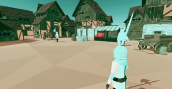

## **Horns and Scrolls** 
- In this game, you play as a medieval peasant who has been tasked with finding two sacred items by the local priest. This is a short combat-focused experience with two full levels. 
- Made in Unity Engine
- Ultimately, this was a learning experience!

## **About Us**
- We are Corner Seat Studios! A couple of high school friends with a passion for game design

## **Screenshots**

## **Usage**
- Feel free to browse our code/assets, most of it is custom made (only some ripped from the interwebs)
- Key features include a custom AI behavior tree, FSMs, custom models and animations, all the works

## **Resources**
- Published on [itch.io](https://cornerseatstudios.itch.io/horns-and-scrolls) (among our other games).

